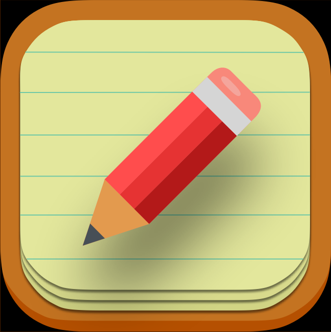

# Tutorials

  
  

## Description

Tutorials is an iOS app that displays several collections of Tutorial topics within a library. The user can scroll
and select through the different sections of topics. Upon selection, a user can see the details of a specific 
topic, as well as see a list of videos related to said topic. The user can queue topics and that list is maintained
within the Queued tab. From here, a user can delete any queued topics. 

Tutorials uses a custom app icon created in the Sketch project that is within in this repo!

## Features

- Presents library of topics with collectionView using orthogonal scrolling
- Mixes frames and auto layout for flexible layouts
- Uses diffable snapshots to animate user-updated state of collectionViews
- Loads raw data from a custom plist
- Light/Dark mode compatible

## App Icon

## Feedback

Any and all feedback is welcome - including pull requests.
